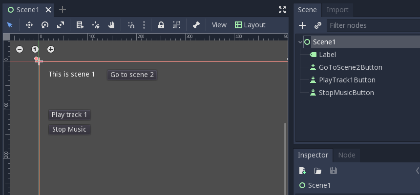
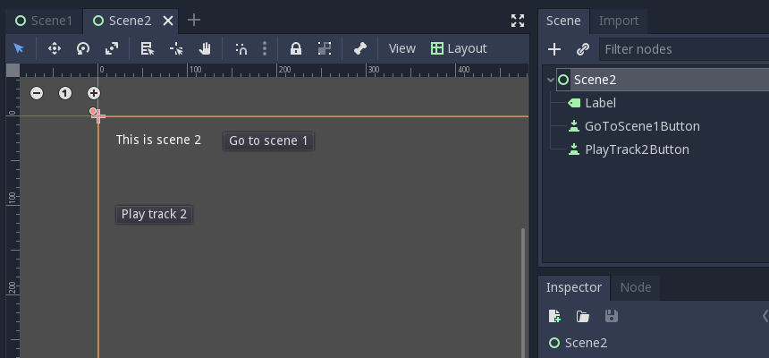
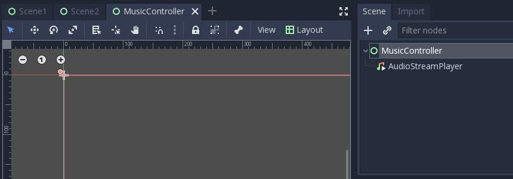
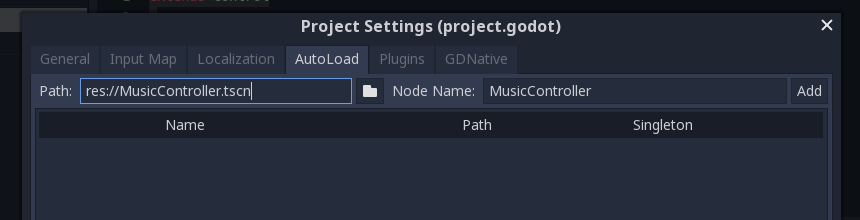
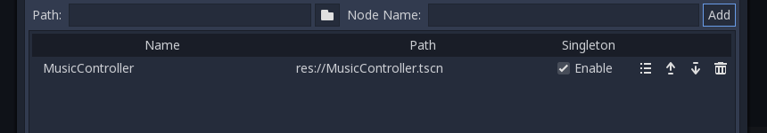

## What we need

### Godot 3.1
You can use another version of Godot, but this tutorial is written with
Godot 3.1.

Download Godot at [godotengine.org](https://godotengine.org)

### Music
Since we're making a music player, you'll need two music tracks. Godot
supports .wav and .ogg formats, but they recommend using
[.ogg for background music](https://docs.godotengine.org/en/3.1/getting_started/workflow/assets/importing_audio_samples.html)
because it takes up a lot less disk space than .wav.

If you don't have music, you can find some nice free tracks at 
[incompetech](https://incompetech.com/music/royalty-free/music.html).


## Autoload
We're going to use the **autoload** feature in Godot. This lets us add
static nodes to the scene tree that will always exist, independent of
our game scenes.

This is perfect to keep our music playing, even if we change the scene.

If you want to learn more about autoload you can
[check out the Godot docs](https://docs.godotengine.org/en/3.1/getting_started/step_by_step/singletons_autoload.html).


## Getting Started
Our project will consist of 3 scenes: **Scene1** and **Scene2** will
be our regular game scenes, and we'll add some buttons to them to
manage the music.

**MusicController** will be our special autoload scene. We'll add some
custom functions to this scene so that we can easily play our music
from anywhere in our game.

### Scene 1
Create a new scene and call it `Scene1`. Then add **1 label and 3 buttons** as in the screenshot below.



Add a script to the root node of the scene, and connect the `pressed()`
events of the three buttons to.

###### Scene1.gd
```gdscript
extends Control

func _on_GoToScene2Button_pressed():
    get_tree().change_scene("res://Scene2.tscn")

func _on_PlayTrack1Button_pressed():
    pass # Replace with function body.

func _on_StopMusicButton_pressed():
    pass # Replace with function body.
```

### Scene 2
Now make another scene and call it `Scene2`. Add **1 label and
2 buttons**.



Next, add a script to the root node of the scene and connect the 
`pressed()` events of both buttons to it. 

###### Scene2.gd
```gdscript
extends Control

func _on_GoToScene1Button_pressed():
    get_tree().change_scene("res://Scene1.tscn")

func _on_PlayTrack2Button_pressed():
    pass # Replace with function body.
```


## Music Controller
Now it's time to create our music controller scene.

Create a new scene and call it `MusicController`. Add **1
AudioStreamPlayer** to play our music.



Add a script to the root node of the scene and add the following code
to it:

###### MusicController.gd
```gdscript
extends Control

# Load the music player node
onready var _player = $AudioStreamPlayer

# Calling this function will load the given track, and play it
func play(track_url : String):
    pass

# Calling this function will stop the music
func stop():
    pass
```

As you see, we have defined 2 functions: `play()` and `stop()`. We'll
be using these to play and stop the music as needed from our game 
scenes.

**Side note:** wondering what that `track_url : String` syntax is? It's 
a new feature in Godot 3.1 called [optional typing](https://godotengine.org/article/optional-typing-gdscript). It means we expect that 
function parameter to be a string, and the editor should warn us if
we call that function with anything that isn't a string.

### Stop()
Let's start with the easiest function to implement. The `stop()`
function simply needs to stop the music - hence its name.

Checking the [documentation](https://docs.godotengine.org/en/3.1/classes/class_audiostreamplayer.html#class-audiostreamplayer-method-stop),
we can see that AudioStreamPlayer has a `stop()` method, so all we need
to do is call that method.

```gdscript
func stop():
    _player.stop()
```

### Play()
This one is a little more involved. When the `play()` function is 
called, we need to do 3 things:

1. Stop the previous track
2. Load the new track from the `track_url` function parameter
3. Start playing the new track.

Luckily, it's not difficult to do any of these things with GDScript.

#### Stop
To stop, the previous track, we simply call our own `stop()` method.
```gdscript
stop()
```

#### Load
Next, we need to load the new track. GDScript makes this very easy
with the `load()` function.
 
```gdscript
var new_track = load(track_url)
```

#### Update
Now we have to update the player and tell it to use the track we just 
loaded.

Returning to the [documentation](https://docs.godotengine.org/en/3.1/classes/class_audiostreamplayer.html#class-audiostreamplayer-property-stream),
we can see that AudioStreamPlayer has a property `stream` that we can
set.

```gdscript
_player.stream = new_track
```

#### Play
Now all we have to do is start the track.

```gdscript
_player.play()
```

#### Everything together
Our MusicController script looks like this now:

###### MusicController.gd
```gdscript
extends Control

# Load the music player node
onready var _player = $AudioStreamPlayer

# Calling this function will load the given track, and play it
func play(track_url : String):
	var track = load(track_url)
	_player.stream = track
	_player.play()

# Calling this function will stop the music
func stop():
	_player.stop()
```


## Set Up Autoload
The last thing we need to do is tell Godot to actually load our 
autoload scene.

Go to the `Project` menu and open `Project Settings`. Then click on the
`AutoLoad` tab. This is where we can configure our autoload scripts.

An autoload script always has a **path** that points to the resource
(either a script or a scene) that should be loaded, and a **name**
that you can use to refer to it in your code.

**Side note:** You can also access autoload nodes through the scene
tree. See the [autoload documentation](https://docs.godotengine.org/en/3.1/getting_started/step_by_step/singletons_autoload.html)
for more information.

To add our `MusicController` scene to the autoload settings, select it 
in the **Path** field. You can look for it with a file browser by 
clicking the little button next to the field.

The **Node name** should automatically get filled based on the name of 
the scene. You can change this if you want, but we'll leave it for now.



Click the **Add** button to add the autoload scene to the project. It 
will appear in the list below.

Every autoload script has some buttons that allow you to edit or remove 
the autoload script, and to change the order in which they are loaded. 
They also have an **enabled** checkbox so you can temporarily disable an 
autoload script without having to delete it and re-add it if you want to 
test something.

Make sure **enabled** is checked for our new MusicController autoload 
script.



And that's it! Our autoload scene has been added and is now active in 
the project! This means we can access the `play()` and `stop()`
functions we made through the global `MusicController` variable. So
let's try that out.


## Using Your Autoload Functions
In the `Scene1` and `Scene2` scripts, we can now call the 
functions we need in the pressed events. The scripts will look 
something like this:

###### Scene1.gd
```gdscript
extends Control

# Switch to the other scene
func _on_GoToScene2Button_pressed():
	get_tree().change_scene("res://Scene2.tscn")

# Load and play track 1
func _on_PlayTrack1Button_pressed():
	MusicController.play("res://tracks/track 1.ogg")

# Stop the music
func _on_StopMusicButton_pressed():
	MusicController.stop()
```

###### Scene2.gd
```gdscript
extends Control

# Switch to the other scene
func _on_GoToScene1Button_pressed():
	get_tree().change_scene("res://Scene1.tscn")

# Load and play track 2
func _on_PlayTrack2Button_pressed():
	MusicController.play("res://tracks/track 2.ogg")
```

Don't forget to set the correct paths to your tracks.


## Done
Now we can run the game and enjoy the music. Notice how it doesn't stop
playing, even if you change to the other scene!

That's what autoload is all about.
