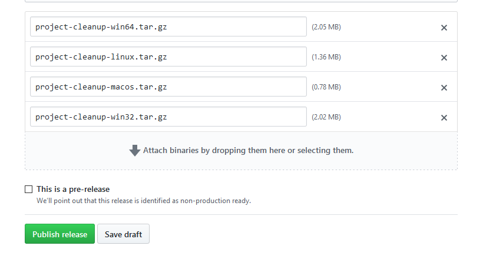

I recently wrote a CLI tool in Rust, called [Project Cleanup](https://github.com/woubuc/project-cleanup). I published it on crates.io, the Rust package manager, so people can install it with `cargo install project-cleanup`. Great! It's published! But this is a program that everyone could use, not just Rust developers, so I wanted to provide a way for non-Rust developers to install it.

These days I mostly write Javascript code so I use npm daily. Npm makes it very easy to install and update global packages, and publishing my Rust program worked surprisingly well. So here's a little guide on how to set it all up.

## Step 0: Research
There are several good solutions to publish binaries to npm, but the most common is using **pre-compiled binaries** that are downloaded as-needed. The npm package will just be a tiny wrapper that downloads the appropriate binary when it's installed. A lot of native packages on npm use a this approach because it's easy to set up and maintain.

We'll be using a package called [binary-install](https://github.com/EverlastingBugstopper/binary-install). It's built by a Rust developer and used for the npm package of [wasm-pack](https://github.com/rustwasm/wasm-pack), a popular tool to compile Rust programs to WebAssemly.

## Step 1: Building the binaries
> I implemented cross-compilation for Windows, Linux and Mac OS through Github Actions for Project Cleanup. You can check out the [build workflow](https://github.com/woubuc/project-cleanup/blob/master/.github/workflows/build.yml) but for this post I'm going to focus mainly on the npm part.

### File structure
The `binary-install` package requires your files to be in a specific structure:

- Your release should be a `.tar.gz` archive
- Inside that archive should be a directory, containing the binary
- The archive filename and the directory name should be the same

So you should end up with something like this:
```
my-program-win64.tar.gz/my-program-win64/my-program.exe
```

This is somewhat of a convention to use when releasing binaries, especially on linux platforms. But it's good to note that `binary-install` expects exactly this structure.

### Creating the files
> The following is a simplified version of the build script I use. Adjust paths, filenames and targets where necessary to fit your program.

#### 1. Compile the binary
First of all, we need to build our Rust program.

```bash
cargo build --release --target=x86_64-pc-windows-gnu
```

#### 2. Create the directory structore
Next, create a new directory and copy the compiled binary into that directory. This is the directory that we'll put in our release archive.

It's best to use a separate directory outside of the `target` directory, because there are a lot of other files in there that don't need to end up in our release.

```bash
mkdir -p builds/my-program-win64

# If you haven't set a target, the path will just be 'target/release/...'
cp target/x86_64-pc-windows-gnu/release/my-program.exe builds/my-program-win64
```

#### 3. Pack the archive
Now all we need to do is pack it all into a nice `.tar.gz` archive.

```bash
tar -C builds -czvf my-program-win64.tar.gz my-program-win64
```

You should have a file called `my-program-win64.tar.gz` now. Repeat as needed for every target you want to support.

## Step 2: Creating a release
Once you have all your release archives, create a new release on Github. You can do this by creating a tag locally and pushing it to Github, or by creating a release via the web interface. Check out the [Github documentation](https://help.github.com/en/github/administering-a-repository/managing-releases-in-a-repository) for more help.

Attach the `.tar.gz` files that you created to the release, write some release notes if you want, then click "Publish release" when you're ready.



Your binaries are ready! Now let's make an npm package that can install them.

## Step 3: Making the npm package
> I like to keep the npm package and the Rust project together in the same repository, but you can also create a separate project for the npm package if you prefer.

Create a new node project and add the `binary-install` dependency.

```bash
yarn init -y
yarn add binary-install
```

The [example project](https://github.com/EverlastingBugstopper/binary-install/tree/master/example) in the `binary-install` repository is very clear and shows us what we need to do &mdash; although we're going to make a few tweaks.

Let's also create a new directory called `npm` to put our scripts.

```bash
mkdir npm
```

### The Binary class
If we want to do anything, we first need to create an instance of the `Binary` class, provided by the `binary-install` package.

#### Get binary
Let's create a function that returns the proper `Binary` instance.

###### npm/getBinary.js
```javascript
const { Binary } = require('binary-install');

function getBinary() {
	const version = require('../package.json').version;
	const url = `https://github.com/username/my-program/releases/download/v${ version }/my-program-win64.tar.gz`;
	const name = 'my-program';
	return new Binary(url, { name });
}

module.exports = getBinary;
```

We get the current version from the `package.json` file, so users can install a specific version of our program. This means that we have to keep our npm package's version synchronised with our release versions.

Don't forget to change the values in `url` and `name`.

#### Multiple platforms
Now you've probably spotted that this will always download the Windows binaries, even on non-Windows platforms. So let's do something about that. We can use the built-in Node.js module `os` to get information about the current platform.

###### npm/getBinary.js
```javascript
const { Binary } = require('binary-install');
const os = require('os');

function getPlatform() {
	const type = os.type();
	const arch = os.arch();

	if (type === 'Windows_NT' && arch === 'x64') return 'win64';
	if (type === 'Windows_NT') return 'win32';
	if (type === 'Linux' && arch === 'x64') return 'linux';
	if (type === 'Darwin' && arch === 'x64') return 'macos';

	throw new Error(`Unsupported platform: ${type} ${arch}`);
}

function getBinary() {
	const platform = getPlatform();
	const version = require('../package.json').version;
	const url = `https://github.com/username/my-program/releases/download/v${ version }/my-program-${ platform }.tar.gz`;
	const name = 'my-program';
	return new Binary(url, { name });
}

module.exports = getBinary;
```

That should do the trick. This function will return the proper `Binary` instance for each supported platform. If you have different platform support, or different filenames, you can adjust the values and checks in the `getPlatform()` function.

### Scripts
With our `Binary` instance, we can do 3 things: `install`, `uninstall` and `run`. So let's create a script for each of those.

###### npm/run.js
```javascript
const getBinary = require('./getBinary');
getBinary().run();
```

###### npm/install.js
```javascript
const getBinary = require('./getBinary');
getBinary().install();
```

###### npm/uninstall.js
```javascript
const getBinary = require('./getBinary');
getBinary().uninstall();
```

It may seem a little excessive to create a separate file for each function, but it's the easiest way to call them from a script in `package.json`.

#### Update package.json
Now that we have the js files for these commands, we'll need to call them from our `package.json`. We'll install the binary with the `postinstall` hook.

###### package.json
```json
{
  "scripts": {
    "postinstall": "node npm/install.js"
  }
}
```

Next, if our program is already installed and the user installs a new version, we should uninstall the old version first. Let's use the `preinstall` hook for that.

###### package.json
```json
{
  "scripts": {
    "postinstall": "node npm/install.js",
    "preinstall": "node npm/uninstall.js"
  }
}
```

Once installed, we want the user to be able to run `my-program` from anywhere. Luckily, [npm supports a `bin` field](https://docs.npmjs.com/files/package.json#bin) in `package.json`. We just need to point it to a script.

###### package.json
```json
{
  "bin": {
    "my-program": "./npm/run.js"
  },
  "scripts": {
    "postinstall": "node ./npm/install.js",
    "preinstall": "node ./npm/uninstall.js"
  }
}
```

We also need to let the system know that this is an executable script, and to run it with `node`. We do this by adding a [shebang](https://en.wikipedia.org/wiki/Shebang_\(Unix\)) to the top of the file.

###### npm/run.js
```javascript
#!/usr/bin/env node

const getBinary = require('./getBinary');
getBinary().run();
```

Shebangs are a Unix concept, but npm will take care of the Windows side for us.

### First install problem
We're almost done, but there's one more thing. I only learned this after releasing the my npm package, because it's not exactly obvious if you've followed these steps in order.

When installing locally, the `preinstall` script is executed **before** any dependencies are installed. But our script `require()`s a dependency. You can probably see where this is going &mdash; another developer who clones the repository and runs `yarn install` will get an error that dependencies are missing, and they'll be unable to install those dependencies.

We'll solve this with a simple `try/catch` and swallow the error. After all, if the dependencies are not found it means the package wasn't installed yet, and that means there's no binary to uninstall in the first place.

###### npm/uninstall.js
```javascript
function getBinary() {
	try {
		const getBinary = require('./getBinary');
		return getBinary();
	} catch (err) { }
}

const binary = getBinary();
if (binary) {
	binary.uninstall();
}
```


## Step 4: Publishing
Now our package is ready to publish. But let's make sure we only publish what's necessary for the npm package to work. We can use the `files` property in `package.json` to define which files get uploaded to npm. The package.json itself is always included, so we just need to add our scripts in the `npm` directory.

###### package.json
```json
{
  "files": [
    "npm/**/*"
  ]
}
```

And that's it. Let's publish!

```bash
npm publish
```
