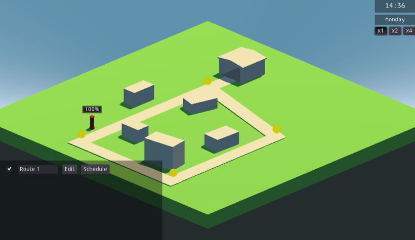
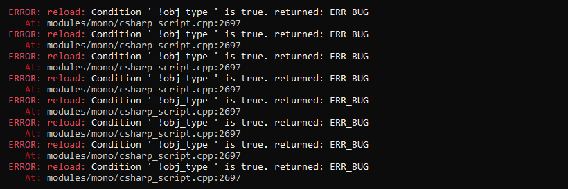

## Our requirements
For the past 6 months, we at [Epic Teddy Games](https://games.epicteddy.com) have been working on the prototype for our first game **Sign for Delivery**.

When we set out to find a game engine to build the game in, we listed some key requirements that each engine should have. Some of these requirements were:

- The option to work with **C#, Java, C++, Rust**, or a similar (relatively) low-level language. We knew Javascript or Lua would not be fast enough to run performance-critical code.
- **Cross-platform export** function for at least Windows, Mac OS and Linux. Bonus points for Android & iOS support, although that isn't our main target.

We tried about 10 different game engines, including indie-favourite [Unity](https://unity.com/solutions/game) and AAA powerhouse [Unreal Engine](https://www.unrealengine.com). We finally settled on [Godot](https://godotengine.org/).

## Choosing Godot
After our tests and first experiences with all these different engines, we decided on Godot because of some key reasons:

- It's **free open source software (FOSS)**. MIT license means no costs or fees to use it, ever.
- It has the most **easy to use GUI tools** of all game engines we tried.
- The system of **nodes and scenes** felt much more comfortable and user-friendly to us than for example Unity's ECS model.

Godot comes in two versions: the regular engine, and the Mono version with C# support. The latter was (and still is) relatively new, but we were advised by existing users of Godot Mono that it was stable enough to build games with.

## First steps
For the first steps, Godot was incredibly easy to get up and running. The download is just an .exe that you run, and you can immediately start adding nodes and seeing your idea come to life. Within a day, I had a simple static world with five "house" cubes, and a vehicle driving around picking up mail.

It had exactly none of the features that the current version has, and it was incredibly simplistic. But it worked and it was playable (as much as you can make something "playable" in a day).

Godot immediately set itself apart from other engines by making the getting starting process fast and easy. Note that I was still just using Godot's built-in scripting language GDScript here, I hadn't started looking into Mono/C# yet.

## Mono setup
Godot's mono build was a little trickier to set up, but only compared to the regular build, because it involved setting up a C# development environment. The Godot developers still managed to make it easy to get up and running.

We at Epic Teddy are big fans of Jetbrains IDEs so the choice to use [Rider](https://www.jetbrains.com/rider/) was an easy one. Godot Mono focuses primarily at Visual Studio, but setting it up with Rider was relatively painless since Rider can work with VS solutions as well.

## Types
The first issue we ran into was with Godot's built-in types. The primitive types (strings, integers, etc) got translated nicely to C#, but more complex types like dictionaries were a little more difficult.

### Collections
Godot uses custom collection implementations namespaced under `Godot.collections.*` (where the builtin C# collections are namespaced under `System.collections.*`). That's not necessarily a bad thing, But it becomes a problem when we needed to use that data with other libraries.

So if we wanted to use an external C# library to process data from a Dictionary that we got from Godot, we had to manually loop over the Dictionary and convert it to a proper C# dictionary. The fact that the types have the same names (`Godot.collections.Dictionary` and `System.collections.Dictionary`) also meant that using both in the same file would cause conflicts, unless we used the fully qualified name for one of them.

Eventually we started to avoid Godot's collections altogether, unless we need them for interop with Godot functions.

### Signals
Another cause of problems with Godot's C# interop are [signals](https://docs.godotengine.org/en/3.1/getting_started/step_by_step/signals.html). You can define custom signals and emit them with any set of variables containing any data type. This is similar to Javascript, and it's one of the great things about dynamically typed languages.

Unfortunately, **signals only support Godot types**. This was not documented, it wasn't obvious, and there were no warnings or errors in the editor. The data just... Disappeared. We lost several hours trying to figure out why *some* signals were getting through and others weren't, until we were able to put two and two together.

Our solution to this was to ditch signals altogether in our C# codebase (except for UI interactivity), and use C#'s builtin events and delegates system.

## Debugging
The biggest problem of Godot is with debugging of more complex code. There had been some hiccups getting the Mono/C# version of Godot working, but nothing we felt like we couldn't handle. But a month or so into the project, we had a major bug. The game just wouldn't start. And we had no idea why. 

### Error handling
If you remember one thing from this post, it should be this: **Godot can't handle C# errors**.

More specifically, Godot can't handle errors that occur in the core engine based on behaviour defined in C#. It can catch a simple runtime error in your C# code, but once the code touches Godot's internals the best you'll get is a cryptic error message without a stack trace.
 
Other times, Godot will forego the error and just crash outright without a trace. This problem is especially noticeable with errors in node hooks like `_Ready()`. We have not yet found a way to fix these errors, other than rolling back what we were doing and losing anywhere between 10-30 minutes of work, plus whatever time we spent trying to debug.

### Runtime vs IDE
The game runtime is somehow tied directly to the IDE core. So if Godot can't handle an error (which happens too often), the process will just terminate without giving any usable information as to why or what happened. And if your build contains a runtime error, Godot may even fail to start.

The solution if this happens is to go to Godot's temp data directory and delete all build artifacts and generated dlls of your game, then restart Godot. 

I don't even know how long we were stuck with an IDE that constantly crashed, because we had an error in our game's runtime, but I'd wager the time we lost on it is counted in days rather than hours.

### Async code
Godot Mono supports `async`. Sometimes.

So far, we haven't figured out what the right circumstances are for an `async` task to work, as there doesn't seem to be a consistent theme. Calling it inline in one place will work, but if we move that line into another method &mdash; or even just a few lines lower within the same method &mdash; it suddenly throws an error (that is to say, Godot will crash again).

## Exporting for distribution

## Open-source climate

### Core developers

### Pull requests

## Community

### Advanced topics

## Conclusion
